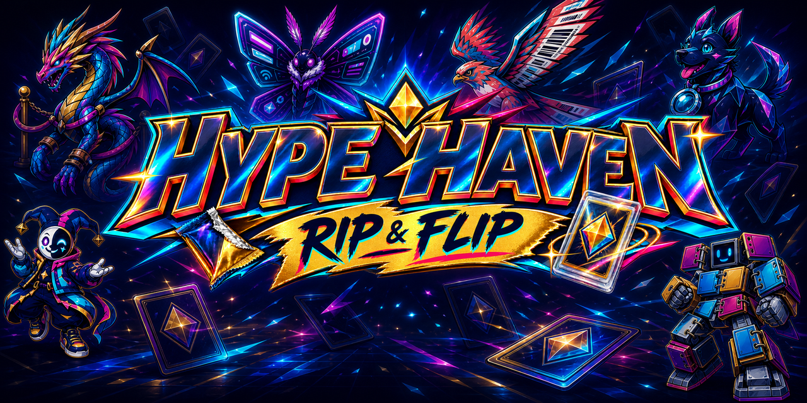

# Hype Haven: Rip & Flip — Mobile Playtest

Welcome to Hype Haven, a character-driven collecting adventure about the rush, rivalry, and community surrounding trading-card culture. Explore town, meet collectors and scalpers, build your collection, manage purchases and grading through HypePhone, and settle confrontations in animated timing-based battles.



This public repository contains no game source code, walkthroughs, hidden-item locations, story solutions, or other in-game secrets. Android players can install the APK from the [latest release](https://github.com/solsatisfaction99-sys/hype-haven-rip-and-flip/releases/latest), and iPhone or iPad players can use the browser edition.

## Play on iPhone or iPad

[**Play Hype Haven in Safari**](https://solsatisfaction99-sys.github.io/hype-haven-rip-and-flip/)

Open the link in Safari, rotate the device to landscape, and tap **START NEW GAME**. The first launch downloads the full playtest (about 300 MB), so Wi-Fi is recommended. Browser saves remain on that device and can be cleared if Safari website data is removed.

## Install on Android

1. Open the [latest release](https://github.com/solsatisfaction99-sys/hype-haven-rip-and-flip/releases/latest) on your Android phone.
2. Under **Assets**, download `Hype-Haven-Rip-and-Flip-Playtest.apk`.
3. Open the downloaded APK from your browser or Files app.
4. If Android asks, allow that app to **Install unknown apps**, then return to the installer.
5. Tap **Install**, then open **Hype Haven: Rip & Flip**.

The playtest supports Android 7.0 or newer on 32-bit and 64-bit ARM phones. It is designed for landscape play. If Android reports that an existing copy cannot be updated, uninstall the older playtest build and install this one again; uninstalling can remove that installation's local save data.

Current APK SHA-256:

```text
b814d23c1d81b8ffae297970a55c04fcc01d2abcf6765ae802bfa781de11b9d4
```

## What's new in 0.6.5

- Rebuilt every pose for all 26 business NPCs with true transparent edges and no white matte outlines.
- Preserved complete feet, props, directional movement, and the existing playable-character-relative scale.
- Re-centered and sharpened exterior building logos and signage so names remain legible without stretching.
- Prevented released D-pad directions from staying highlighted or accumulating multiple active highlights.
- Added the iPhone/iPad browser playtest while retaining the Android APK.

## Touch controls

- **Start:** Tap **START NEW GAME**, **CONTINUE SAVED GAME**, or **CHOOSE CHARACTER**. Continue restores the saved street or building and walking position.
- **Move:** Hold the traditional cross-shaped on-screen D-pad. Adjacent directions can be held together for diagonal movement.
- **ACTION:** Enter locations, inspect nearby objects, talk, choose a route, and advance conversations.
- **HYPEPHONE:** Use the single button at the top of the game screen. Each app has its own rounded controls and **CLOSE** action.
- **Character selection:** Available from the startup menu; each page shows six complete character cards with visible selection buttons.
- **Battles:** Tap one of the four move buttons, then tap **TAP TO LOCK** when the moving meter reaches the gold zone.
- **Menus:** Tap the visible **BACK**, **CLOSE**, **CONTINUE**, or confirmation button shown on the current screen.

Progress autosaves after important changes, every ten seconds during exploration, when Android backgrounds the game, and when Back returns to the startup menu.

## Send playtest feedback

Please use [GitHub Issues](https://github.com/solsatisfaction99-sys/hype-haven-rip-and-flip/issues/new) for bugs and feedback. One issue per problem is easiest to track. Include:

- Phone manufacturer and model
- Android version
- What you were doing when the problem occurred
- Steps that reproduce it
- What you expected and what happened instead
- Whether it happens every time
- A screenshot or short screen recording when useful

Keep issue titles spoiler-free. If a report requires story details, hide them in the issue body with GitHub's collapsed-details formatting or clearly label the section **Spoilers**.

## Playtest notice

This is a directly shared playtest build, not a Google Play release. Features, balance, performance, and save compatibility may change during testing.
